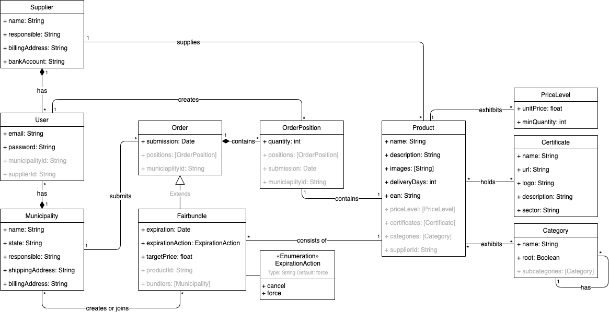

# Data Model

## UML Class Diagram

### Explanation:

The UML Class Diagram displays a data model implemented with a NoSQL MongoDB.

The field `id` is automatically created (as `_id` field), when respective entity is modeled as database collection. This is the case for all entities except for `PriceLevel`  (defined inline in `Product` model's field).

The grayish displayed id-fields represent a foreign key, i.e. a reference to a certain entity.

## Entities (by logical units)

### User / Supplier / Municipality

A `User` is either registered as member of a `Municipality` and therefore has a `municipalityId` or as member of a `Supplier` with a `supplierId` respectively. 

As user information, the fields `email` and `password` (used for login) are required.

Further information (such as `billingAddress` or `responsible`) are associated to user's municipality or supplier.

### Product / PriceLevel / Certificate / Category

A `User` (authenticated, having `supplierId`) can create a `Product`, characterized by the fields `name`, `description`,  `picture` (base64 encoded bitmap), `deliveryDays` and arbitrary `priceLevel`. 

These are further used when product bundles are created. Therefore, the `PriceLevel`for one product contains a `unitPrice` for a minimum quantity `minQty` that has to be ordered.

A product holds divers `Certificates`and belongs to one or more `Category` , captured by its fields `certificates` and `categories`

### Order / BundleOrder / OrderPosition

A`User` (authenticated, having `municipalityId`) can create a `OrderPosition`, characterized by a quantity `qty` and referring to a one certain `Product` , and one certain `Order` (which is *composed* of at least one `OrderPosition`)

Each `Order` has therefore the field `positions` and its submission date (triggered by the respective `Municipality`) is captured by `submission`.

The `BundleOrder` extends a "regular" `Order` by setting `expiration` as end date of a "bundling period" . This is the period in which another `User` can add their `OrderPosition` to the `BundleOrder`, with the restriciton that these `OrderPosition` having the same `productId` that is associated with the `BundleOrder`. It assures, that bundles are always homogenous, consisting of one product.  

As a `User` that adds a `OrderPosition` to an existing  `BundleOrder` is associated with a `municipalityId`, the  `BundleOrder` records all involved `Municipality` as `bundlers` in a dedicated field. 

The `User` initiating the `BundleOrder` has to set `expirationAction` that defines, which action should be taken after the date set in `expiration` is reached, i.e. if the submission should be places anyways or only under the condition of reaching a certain `targetPrice` (associated with a certain quantity, as defined in `priceLevel`of the bundled `Product`)
